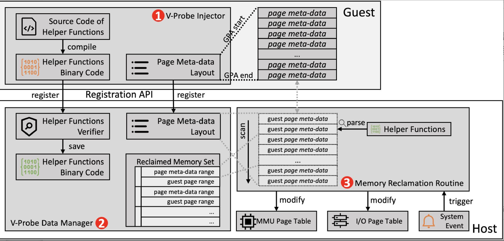

# Introduction-Motivation
本文研究了虚拟化环境中，如何通过细粒度页面元数据管理有效地进行内存超额分配。传统的I/O直通技术虽然降低了I/O虚拟化的开销，但它在虚拟机的整个生命周期内要求维持固定的内存映射，从而避免直接内存访问（DMA）失败。这限制了内存超额分配的使用，因为动态内存回收会改变虚拟机的内存映射。

# Problem definition
内存超额分配技术可以改善虚拟化环境中的内存资源利用率，特别是当虚拟机内存不是活跃使用时。然而，I/O直通技术的引入使得内存超额分配复杂化，因为它要求在虚拟机生命周期内保持不变的内存映射以防止DMA失败。现有的解决方案如I/O页面故障（IOPF）和参数虚拟化技术虽然试图解决这一问题，但存在性能损失和兼容性问题。

# Proposed method

## Intuition
本文提出的V-Probe方法通过细粒度的页面元数据管理，允许虚拟机管理程序主动且高效地检测并回收空闲页面，同时确保DMA安全。这种方法预计能显著优于现有的内存回收方法，如Ballooning和基于IOPF的方法，因为它能在保证较低延迟的同时减少对宿主机和其他虚拟机的干扰。
本方法的具体优势如下：
1. 细粒度的页面元数据管理
    - 通过细粒度地追踪每个内存页面的状态，V-Probe能够更准确地识别出当前未被使用或空闲的内存页面。这种精确控制减少了不必要的内存交换操作，降低了对系统性能的影响。
    - 传统方法如Ballooning依赖于虚拟机内的驱动来报告空闲内存，这引入延迟并依赖于客户操作系统的协作。V-Probe通过Hypervisor直接管理和更新内存映射，避免了与虚拟机内部通信的需要，提高了操作的响应速度。
2. 高效的内存回收机制
    - V-Probe通过预先注册的辅助函数快速检测空闲页面，并实时进行内存回收。这比传统的依赖于虚拟机操作系统内部机制的回收方法（如内存交换）更为高效。
    - 由于V-Probe减少了对磁盘交换空间的依赖，它能够显著减少因内存交换操作引起的性能波动，特别是在内存需求高峰时。
3. DMA安全性保障
    - V-Probe在内存回收过程中动态更新I/O页面表，确保即使在内存页被回收后，任何指向该页面的DMA操作也能安全执行。

## Description of its algorithms 

V-Probe包括三个主要组成部分：注射器、数据管理器和内存回收程序。
1. V-Probe注射器：
    - 在虚拟机启动后立即执行。
    - 负责向Hypervisor注册虚拟机内存页面的元数据布局信息，这些信息描述了每个物理页面的状态（如是否被分配）和位置。
    - 还负责注册一组辅助函数，这些函数用于解析页面元数据，以便Hypervisor能够理解和操作这些数据。
2. V-Probe数据管理器：
    - 存储注射器提供的页面元数据布局和辅助函数。
    - 负责管理这些数据，并在执行内存回收操作时提供必要的信息和接口。
    - 通过细粒度的访问控制，确保页面元数据的安全，防止恶意软件通过虚拟机影响Hypervisor的正常运行。
3. 内存回收程序：
    - 核心组件，负责实际的内存回收操作。
    - 通过分析页面元数据，确定哪些内存页面是空闲的，可以安全回收。
    - 利用注射器提供的辅助函数，动态修改虚拟机的内存映射，确保DMA操作不会访问已回收的内存页面。
    - 在回收内存时，会调整相关页面的元数据并更新I/O页面表，以防止DMA错误。

**工作过程**：V-Probe注射器在虚拟机启动时自动运行，负责识别并注册内存页面的元数据布局及其状态和位置，同时编译并上传辅助函数到Hypervisor以便解析和操作这些元数据。V-Probe数据管理器则接收这些信息，并建立索引结构以便高效访问，同时确保通过严格的安全验证来防止恶意代码执行。内存回收程序定期扫描虚拟机的内存使用状况，利用注射器提供的辅助函数来确定哪些空闲页面可以被安全回收。程序更新被回收页面的状态并调整I/O页面表，以确保这些页面不会因DMA操作而引发故障，并能动态地响应虚拟机对已回收内存页的访问请求，通过重新映射或重新分配来保证操作的连续性和数据的完整性。此外，V-Probe系统还持续监控和调整内存回收策略，以优化资源利用率和系统性能，同时持续监控辅助函数和页面元数据的安全性，确保系统免受潜在的安全威胁。

# Conclusions
V-Probe在内存回收和重新分配过程中的微秒级开销，大幅优于传统方法。此外，V-Probe对于不同的硬件和广泛的Linux内核版本都具有良好的兼容性，这简化了其在现实世界虚拟化环境中的部署。V-Probe不仅提高了内存利用率，还通过确保DMA安全，有效地减少了性能损失。
