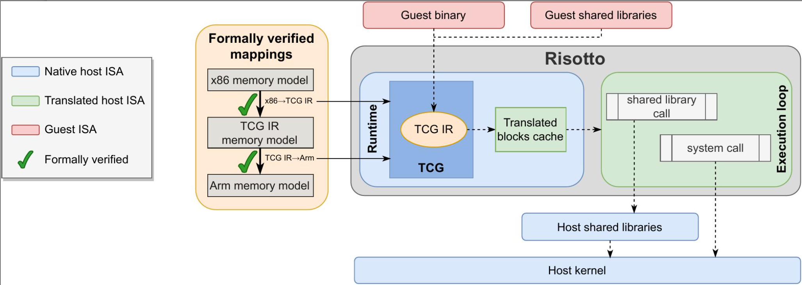
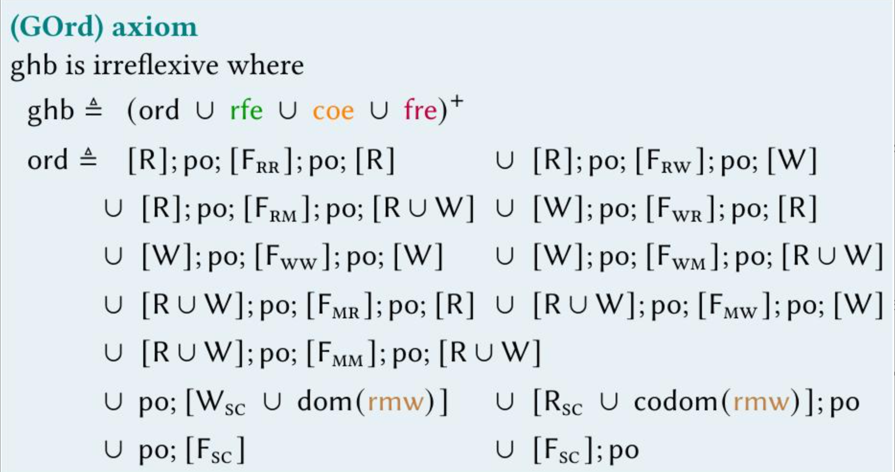
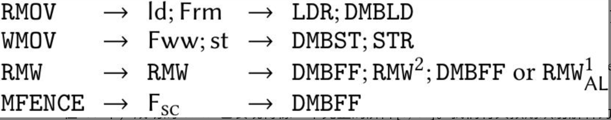
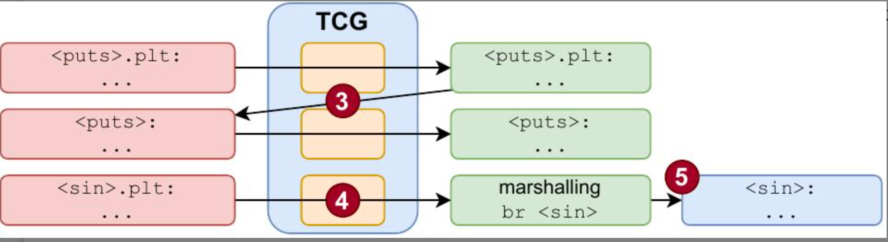

# Introduction - Motivation
随着 Arm 和 RISC-V 等新指令集架构 (ISA) 的出现和流行，带来了软件兼容性问题，动态二进制翻译 (DBT) 技术比如Risotto，旨在通过在运行时在主机上模拟程序的来宾 ISA 来解决此问题。

# Problem Definition
论文解决的核心问题是在从强内存模型（如x86）转换到较弱内存模型（如Arm）时，客户端和宿主架构之间内存模型语义的不匹配导致性能下降和正确性问题。现有的DBT系统如Qemu在转换不同ISA时往往强制执行比必要更强的排序，这影响了性能且未能解决翻译错误。

# Proposed Method
## Intuition - why should it be better than other methods?
Risotto的核心思想是通过采用形式化验证的映射方案来改善动态二进制翻译（DBT）系统的性能和正确性。通过形式化验证，确保所采用的映射方案在不牺牲性能的前提下，可以正确地模拟源架构的内存行为。

## Description of its Algorithms
Risotto在Qemu基础上实现并扩展,具体的内容包括：

1. 内存模型的形式化和验证：Risotto首先定义了一个针对Qemu中间表示（TCG IR）的形式化内存模型，这一模型不仅覆盖了从x86到Arm的翻译，还针对TCG IR到Arm的映射进行了形式化验证。

2. 内存屏障的优化：通过分析和验证，Risotto在翻译过程中优化了内存栅栏的放置。通过减少不必要的内存栅栏并调整其位置，Risotto能够减少运行时的性能损失。

3. 动态链接器的使用：Risotto实现了一个动态链接器，该链接器在运行时能够智能地决定是否使用宿主系统的本地共享库，而不是翻译来自客户端架构的库。这大大提高了执行效率，因为本地库通常比翻译后的库更优化。

4. Compare-and-Swap (CAS) 操作的优化：Risotto还优化了CAS操作的翻译，利用了Arm架构中的最新原子指令，以提高这些关键操作的效率和正确性。

# Conclusions
Risotto 的评估表明，在保持内存排序正确性的同时，仿真性能比 Qemu 显着提高了 19.7%。Risotto 不仅解决了 DBT 中弱内存模型带来的问题，而且还提供了可扩展到其他架构和场景的可扩展解决方案。
