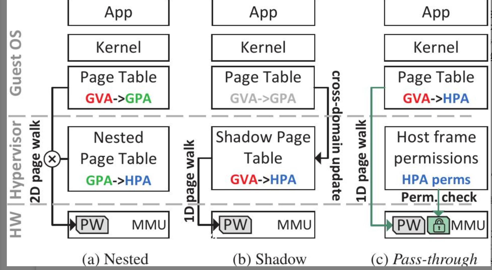
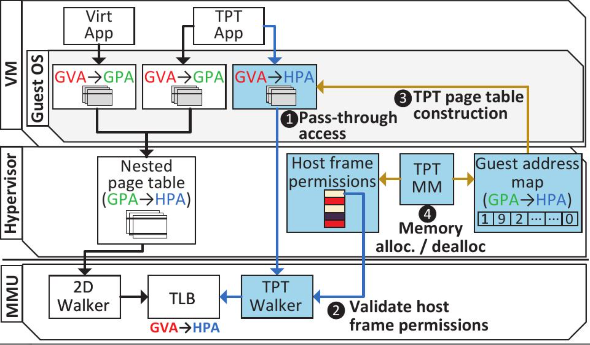

# Introduction-Motivation
虚拟机在云计算中发挥了很重要的作用，传统的内存地址转换技术（如嵌套分页和影子分页）在虚拟机中引入了显著的性能开销。随着应用程序对更大工作集和更多物理内存的需求增加，这些性能开销将会继续增长。为了解决这一问题，论文介绍了一种名为“转换透传”（Translation Pass-Through, TPT）的新方法。

# Problem definition
在虚拟机中，内存地址转换的传统方法包括嵌套分页和影子分页。
- 嵌套分页虽然减少了对管理程序的依赖，但增加了地址转换的延迟，虚拟机内部的应用程序通过内核使用页面表将客户虚拟地址（GVA）转换成客户物理地址（GPA）。嵌套页面表进一步将GPA转换成主机物理地址（HPA）。这种方式涉及两级页面走动（2D Page Walk），由处理器的内存管理单元（MMU）和页表行走器（PW）执行，导致较高的延迟；
- 影子分页由管理程序（Hypervisor）维护，并将GVA直接映射到HPA。这种方法避免了两级页面走动，但需要管理程序在客户页面表更新时同步影子页面表，涉及跨域更新（Cross-domain update）。

# Proposed method
## Intuition
转换透传（TPT）机制允许虚拟机直接控制从客户虚拟地址到主机物理地址的转换，消除了嵌套分页中的二维页面遍历，并减少了影子分页中的管理程序介入。此外，通过新的硬件支持（如物理内存标签），TPT能够在不牺牲VM间隔离性的前提下提高性能。 透传使虚拟机直接使用页面表将GVA映射到HPA，跳过了GPA这一层转换，这种方法通过在硬件级别检查HPA的权限（Perm. check）来确保安全性和隔离性，避免了页面走动过程中的额外延迟。这是通过在MMU中进行权限校验来实现的。

## Description of its algorithms
TPT的工作过程如下：

1. 一维页面表：与传统的二维页面表（嵌套分页）相比，TPT使用一维页面表直接映射客户虚拟地址到主机物理地址。在TPT应用（TPT App）中，GVA（Guest Virtual Address，客户虚拟地址）直接转换为HPA（Host Physical Address，主机物理地址），绕过了传统的GPA（Guest Physical Address，客户物理地址）层。

2. 物理内存标签：TPT利用最新的硬件支持的物理内存标签来维护虚拟机之间的内存隔离。每个虚拟机被分配唯一的标签，并且每次内存访问都会检查该标签，确保虚拟机只能访问分配给它的物理内存。这种机制在硬件层面上提供了安全保障，同时由于是在硬件层面上执行，所以其开销非常小。

3. 动态启用和透明管理：TPT支持在用户空间动态启用，意味着操作系统可以根据应用程序的具体需求选择启用或禁用TPT。此外，对于操作系统和应用程序而言，TPT的管理过程是透明的，无需修改现有代码即可受益于TPT带来的性能提升。

# Conclusions
论文通过实验验证了TPT在现实世界的数据中心应用中能够显著提高性能，相比于传统的嵌套分页和影子分页，TPT在某些基准测试中的性能提升达到了2.4倍和1.4倍。
